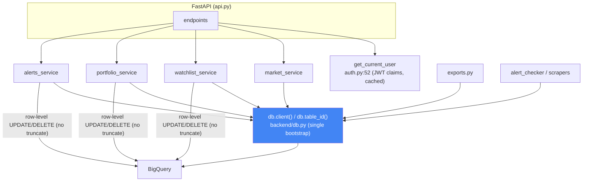

# Unified Data-Access Proposal — backend

Simplest-unification-wins. No new abstraction layers "for flexibility"; delete over abstract.

## Fix 0 (CRITICAL, do first) — replace truncate-and-reload with row-level DML

Every `_rewrite_table` mutation becomes a targeted BigQuery DML statement. No whole-table read, no truncate.

| Old call site | Becomes |
|---|---|
| `remove_from_watchlist` (bq_service.py:242) | `UPDATE watchlists SET is_deleted=TRUE, updated_at=@now WHERE user_id=@uid AND symbol=@symbol` |
| `update_portfolio` (bq_service.py:298) | `UPDATE portfolios SET ... WHERE id=@id AND user_id=@uid` |
| `delete_portfolio` (bq_service.py:320) | `UPDATE portfolios SET is_deleted=TRUE ... WHERE id=@id AND user_id=@uid` |
| `delete_alert` (bq_service.py:385) | `DELETE FROM price_alerts WHERE id=@id AND user_id=@uid` |

`_rewrite_table` is **deleted**. `_insert_rows` (WRITE_APPEND) stays for adds. All predicates parameterized (`@param`).

> Capability loss: none. BigQuery DML has quotas (not built for very high-frequency single-row writes), acceptable at this scale; note it and revisit only if write volume demands a row store.

## Fix 1 — one BigQuery client + one table-name helper

Create **`backend/db.py`**: a single lazily-constructed `client()` and one `table_id(name)` (pick the backtick convention). Credential resolution (the `GCP_SERVICE_ACCOUNT_JSON` → temp-file logic now only in `bigquery_helper.py:14-32`) moves here so every caller gets the same auth path — killing the import-ordering dependency.

| Old | Becomes |
|---|---|
| `bq_service.py:15` module client + `_full_id` | `from .db import client, table_id` |
| `user_service.py:13` client + `_uid` (hardcoded project) | same import (env-driven now) |
| `exports.py:16` `_get_bigquery_client` + `_get_full_table_id` | same import |
| `utils/bigquery_helper.py` `BigQueryHelper` | thin shim over `db.client()`, or retire once ETL scripts migrate |

## Fix 2 — cache the per-request user lookup

`get_current_user` (auth.py:52) should not hit BigQuery every call. Cheapest: embed `email`/`role` in the JWT at issue time (they're already known at login) and read them from the decoded token; fall back to a `get_user_by_id` lookup only when a fresh record is genuinely needed. No Redis required for v1.

## Fix 3 — split the god module (lowest priority)

Once `db.py` exists, `bq_service.py` splits by domain: `market_service`, `watchlist_service`, `portfolio_service`, `alerts_service`, each importing `db`. Mechanical; do it after Fix 0–2 land so diffs stay reviewable.

## Unified flowchart (target)

