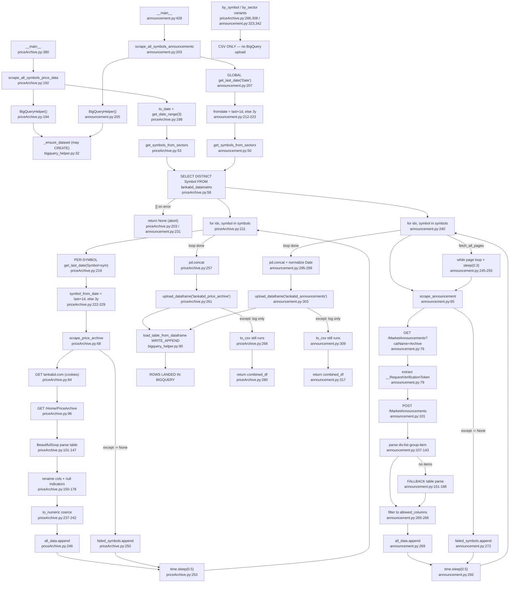

# Flowchart — Per-symbol incremental ETL

`priceArchive.py` + `announcement.py`. One skeleton, two payloads. No in-repo callers; both are
`python <script>.py` only. No scheduler, cron, or CI invocation exists.

## Notable behaviours (evidence)

- **Incremental logic diverges materially.** `priceArchive.py:219` calls `get_last_date` **per symbol inside
  the loop** (N queries for N symbols). `announcement.py:207` calls it **once, globally, before the loop** —
  one `fromdate` for every symbol.
- **Upload failure exits 0.** Both catch upload errors and only log (`priceArchive.py:263`,
  `announcement.py:305`); the CSV still writes and the function still returns the DataFrame. A failed ETL
  looks like a successful one to any caller or scheduler.
- **No dedupe.** `get_last_date` + 1 day is the only overlap defense on an append-only table.
- **Error isolation differs.** priceArchive catches bare `Exception`; announcement catches only
  `(AttributeError, ValueError, KeyError)` — a `TypeError` in parsing aborts the whole run.
- **by_symbol/by_sector variants never upload** (`:286`, `:308`, `:323`, `:342`) — CSV only. Only the
  `__main__` all-symbols paths land rows.
- Latent: `priceArchive.py:228`'s `except` handler formats `last_date`, bound only inside the `try` at `:219`.
  Not currently reachable (`get_last_date` swallows its own exceptions), but a live `UnboundLocalError` if
  that ever changes.

## External dependencies

- **Reads:** `lankabd_datamatrix` (produced by dataGrid) — data-coupled, not an import edge.
- **Calls:** `utils/bigquery_helper.BigQueryHelper` → `backend/db.py`; `utils/logger.Log`.
- **Writes:** `lankabd_price_archive`, `lankabd_announcements` (append-only), CSV to cwd, `logs/`.

## Confidence

High on control flow and side effects (both files read in full). Gaps: live lankabd.com HTML not verified,
so which parse branch fires is inferred from code order; no test coverage exists for either script.
