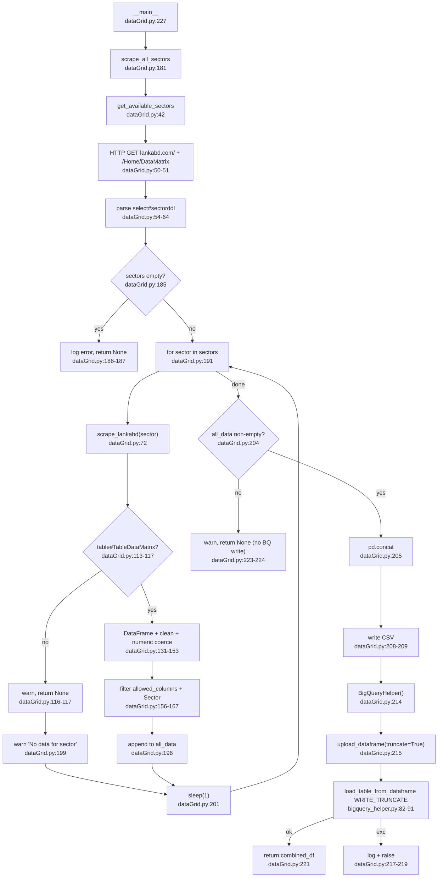
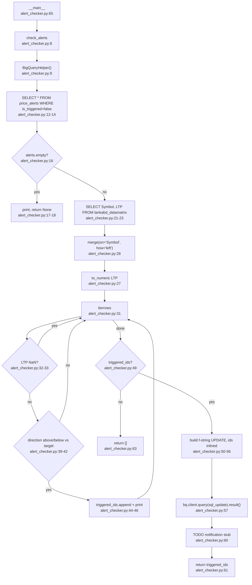

# Flowcharts — Sector snapshot ETL + Alert triggering

## Feature A — Sector snapshot ETL (`dataGrid.py`)

### Truncate semantics — the destructive path

`scrape_lankabd` swallows every per-sector failure and returns `None` (`:174-179`); `scrape_all_sectors`
only logs a warning and continues (`:198-199`). There is **no completeness gate** — the only guard is
`if all_data:` (`:204`), which passes when **one** sector succeeded. A half-failed run therefore concatenates
the partial set and issues `WRITE_TRUNCATE` (`bigquery_helper.py:82-83`), **replacing the entire symbol
universe with the partial one.**

Downstream blast radius: `priceArchive.get_symbols_from_sectors` (`priceArchive.py:57`) and
`announcement.py:54` do `SELECT DISTINCT Symbol FROM lankabd_datamatrix`, so they silently scrape only the
surviving subset. `alerts_service.get_alerts` (`alerts_service.py:19`) LEFT JOINs it, so missing symbols
yield `current_price = NULL`. No snapshot or staging table exists — the truncate is unrecoverable except by
a successful rerun.

## Feature B — Alert triggering (`alert_checker.py`)

### Findings

- **Column-case mismatch (suspected hard failure).** `create_alert` writes the column `symbol`
  (`alerts_service.py:31`) and `get_alerts` reads `a.symbol` (`:15`). But `alert_checker.py:26` merges
  `on='Symbol'` and `:46` reads `row['Symbol']`. With `SELECT *`, the alerts frame carries `symbol`, so the
  merge key is absent on the left → `KeyError: 'Symbol'` before any update. This precedes every other issue
  in this feature.
- **Unparameterized DML.** `:51-55` interpolates `id` values and `now` straight into the SQL. Every other
  mutation uses `db.execute_dml` with `ScalarQueryParameter` (`db.py:119-128`, `alerts_service.py:44-49`).
  Ids are server-generated `uuid4` (`alerts_service.py:28`), so it is not exploitable today — it is a
  defense-in-depth gap, not a live vulnerability.
- **Notification is committed-then-dropped.** `:60` is a comment-only TODO placed *after* `is_triggered=true`
  is committed at `:57`. The alert is marked consumed and the user is never told. Lossy by construction: no
  outbox, no retry state.
- Not double-triggerable (`WHERE is_triggered = false` + the UPDATE make it once-only).
- Inconsistent returns: `None` (`:18`), `triggered_ids` (`:61`), `[]` (`:63`).

## External dependencies

`requests`/Retry, beautifulsoup4/lxml, pandas, numpy, google-cloud-bigquery; `utils.logger.Log`;
`utils.bigquery_helper.BigQueryHelper` → `backend/db.py`. Network: `lankabd.com`. BigQuery:
`lankabd_datamatrix` (A writes/truncates; B, priceArchive, announcement, alerts_service read),
`price_alerts` (B reads + updates).

## Confidence

High on control flow (both files read in full, plus every downstream `lankabd_datamatrix` reader).
**Gap:** no DDL for `price_alerts` exists in the repo, so the `symbol` vs `Symbol` mismatch is inferred from
the writer/reader in `alerts_service.py` rather than confirmed against the live table. If the deployed table
has a legacy capitalized column, that finding drops.
