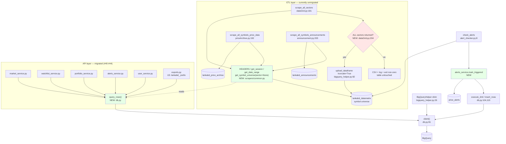

# Unified Proposal — backend/ (2026-07-16)

Five proposals, ordered by severity. Three are correctness fixes; two are consolidation.

The shape of this audit differs from 2026-07-15. That one found **one** cross-cutting concern (four client
bootstraps) and unified it. This one finds the cleanup **stopped at the API boundary**: the ETL layer never
migrated, and it is where the remaining defects live. Every proposal below is deletion or a fix — none adds a
layer.

---

## U1 — `alert_checker` rewritten onto `db` + `alerts_service` (correctness + security)

**Concern:** D5. The last legacy data-access idiom, the only unparameterized DML, and a suspected hard failure.

Three defects in 66 lines:
1. `alert_checker.py:26` merges `on='Symbol'`; `alerts_service.py:31` writes the column `symbol`. With
   `SELECT *` the merge key is absent → `KeyError` before any alert fires. **The batch job likely does not run
   at all.** Verify against the live table first — if `price_alerts` has a legacy capitalized column, this
   drops and only defects 2–3 remain.
2. `:51-55` interpolates ids and a timestamp into SQL. Not exploitable today (ids are server-generated
   `uuid4`), but it is the one writer bypassing `db.execute_dml`.
3. `:60` — the notification TODO sits *after* the `is_triggered=true` commit at `:57`. The alert is marked
   consumed and nobody is told. That is data loss with no outbox and no retry state.

**Unified design:** `check_alerts()` reads through `alerts_service`, writes through **one** new
`alerts_service.mark_triggered(alert_ids)` that calls `db.execute_dml` with an `ArrayQueryParameter`. Single
entry point; the `BigQueryHelper` import disappears.

**Loss of capability:** none. Defect 3 is only *contained* here (commit-after-notify ordering), not solved —
solving it needs the notification channel decision on **#34**, which is still fog. Ordering the commit after
the send is the honest half-fix available now.

## U2 — Completeness gate before `dataGrid`'s truncate (correctness)

**Concern:** the destructive path in `01-flowcharts/sector-etl-and-alert-triggering.md`.

`scrape_all_sectors` guards its `WRITE_TRUNCATE` with `if all_data:` (`dataGrid.py:204`) — which passes when
**one** of N sectors succeeded. A half-failed scrape replaces the entire symbol universe with a partial one,
and both downstream scrapers plus `alerts_service.get_alerts` silently narrow to the survivors.

**This is the same class of bug as #40** (truncate-and-reload destroying rows that the run never saw), one
layer up: #40 destroyed *other users' rows*, this destroys *the symbol universe*. #40 is why the API path no
longer truncates; nothing applied that lesson here.

**Unified design:** `scrape_all_sectors` refuses to truncate unless every sector in `get_available_sectors()`
returned data. On a partial scrape: write the CSV, log the failed sectors, exit non-zero, leave the table
alone. A stale-but-complete universe beats a fresh-but-partial one.

**Loss of capability:** a partial refresh can no longer land. That is the point.

## U3 — `db.query_rows()` (consolidation)

**Concern:** D4. #41/#43 gave writes `insert_rows`/`execute_dml` and gave reads nothing. The
`[dict(r) for r in bq.query(sql, job_config=QueryJobConfig(query_parameters=params)).result()]` idiom is
copied **9×**.

**Unified design:** one function in `db.py`:

```python
def query_rows(sql: str, params: list | None = None) -> list[dict]:
    job_config = bigquery.QueryJobConfig(query_parameters=params or [])
    return [dict(r) for r in client().query(sql, job_config=job_config).result()]
```

Each of the 9 call sites becomes `return db.query_rows(sql, params)`. The module-level `bq = db.client()`
preamble (5 files) goes with it — which also closes the **eager import-time client** follow-up already noted
on #43: reads become stubbable via `db._client`, exactly as mutations already are.

**Anti-pattern guard:** not a query builder, not a repository class, not an ORM. One function; the SQL stays
written out at each call site where it is readable.

## U4 — `backend/scrapers/common.py` (consolidation)

**Concern:** D1 + D2. ~35 lines with a **0-line semantic delta**, triplicated.

**Unified design:** one module holding `HEADERS`, `get_session()`, `get_date_range()`, and
`get_symbol_universe(sector=None)` (D2's two copies collapse into the one parameterized function — with the
`sector` value passed as a query parameter rather than interpolated). The three scrapers import it.

**Anti-pattern guard:** **no `BaseScraper` class.** The three scrapers have genuinely different shapes —
dataGrid has no symbol fanout, announcement paginates and POSTs a CSRF token, priceArchive GETs. Inheritance
would force those differences into template-method hooks and make three readable scripts into one unreadable
hierarchy. A module of plain functions, imported. D3's ~90-line orchestration overlap is **explicitly not in
scope** for the same reason — that is where the legitimate specialization lives.

## U5 — Reconcile the export table names (correctness)

**Concern:** D6. `exports.py:31` reads `announcements` and `:57` reads `price_archive`; the writers produce
`lankabd_announcements` and `lankabd_price_archive`. Two of three admin exports likely 404 on a missing table.

**Unified design:** confirm against live BigQuery **first** — this is the one finding that needs a real
credential, and if those legacy tables exist the fix is different (a backfill/rename, not a string edit).
Then point both at the `lankabd_`-prefixed names. `_list_tables()` (`exports.py:19`) can assert the table
exists so the failure is a clear 404 rather than an opaque BigQuery error.

**Loss of capability:** none.

---

## Proposed unified flowchart



## What this proposal deliberately does not do

- **No `BaseScraper`** — see U4.
- **No unification of D3's orchestration loops** — that is where the real specialization is.
- **No notification architecture** — that is #34's decision to make, not this audit's.
- **No feature flags, no registry, no factory, no compatibility shims.** Every item above is a deletion, a
  gate, or one function.
